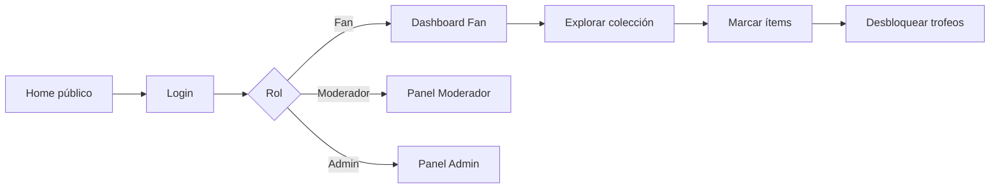
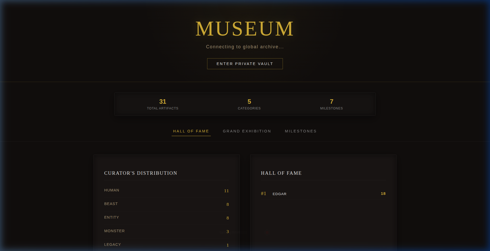
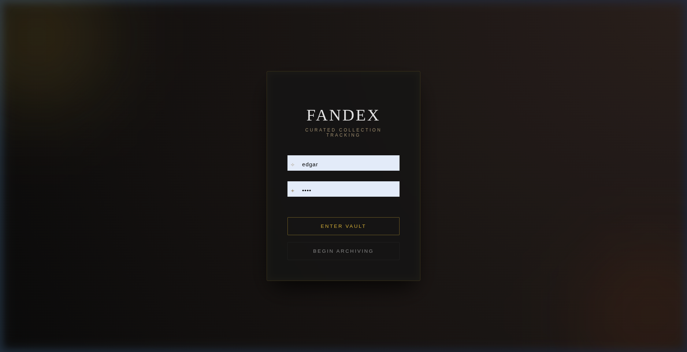
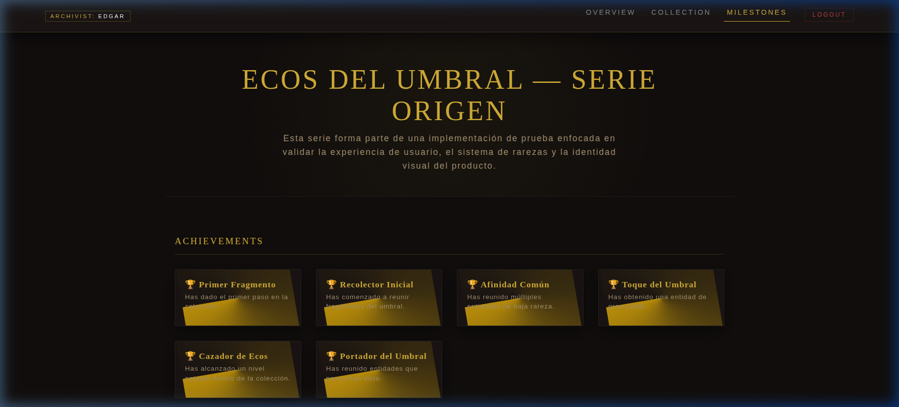
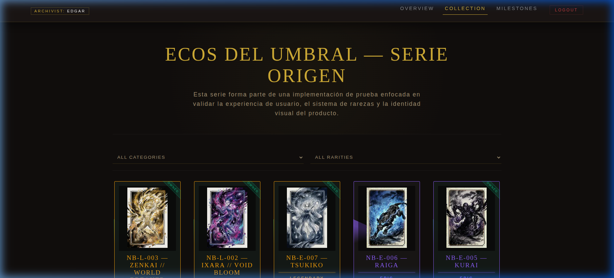
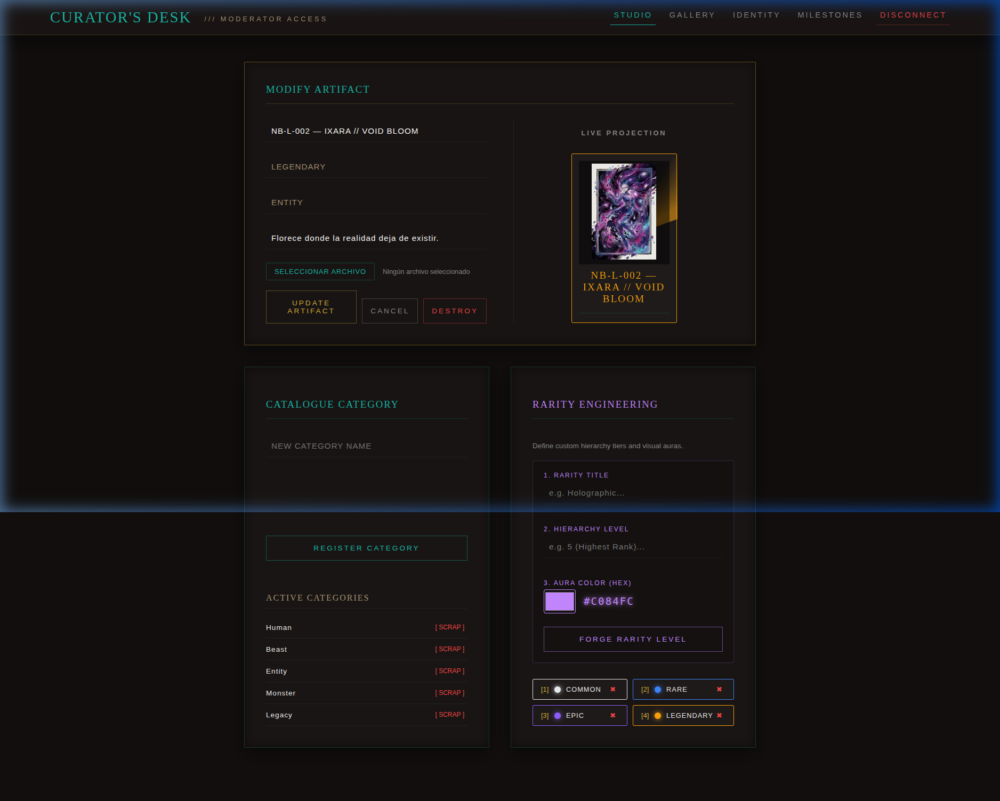
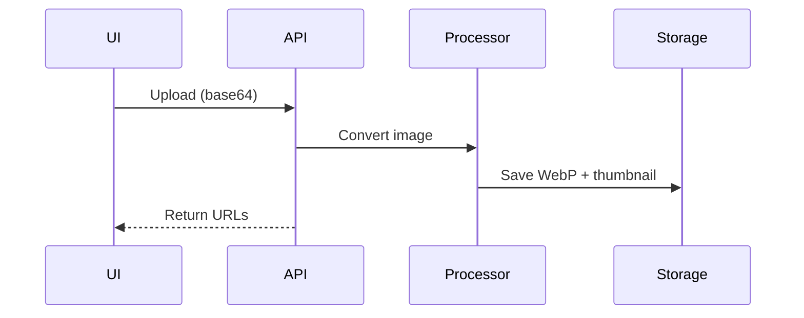
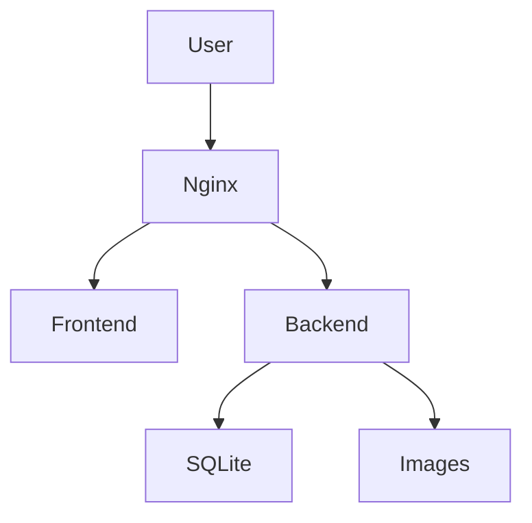

# 🚀 FanDex

## 🧠 ¿Qué es FanDex?

FanDex es una plataforma de coleccionismo digital donde los fans pueden completar colecciones, seguir su progreso y desbloquear logros conforme avanzan.

El sistema está diseñado para ser simple, visual y fácil de entender en pocos segundos.

---

## 💡 Idea principal

A diferencia de otros sistemas:

> El contenido de la colección no lo define el administrador, sino la comunidad (moderadores).

Esto permite crear colecciones más ricas, especializadas y alineadas con los intereses reales de los fans.

---

## 🎨 Contenido del demo

La colección mostrada en esta aplicación fue creada exclusivamente para este demo.

Se utilizaron ilustraciones y nombres ficticios con el objetivo de:
- evitar el uso de propiedad intelectual externa  
- mantener un entorno controlado de prueba  
- enfocarse en la experiencia de usuario  

El sistema está diseñado para adaptarse a cualquier tipo de colección real.

---

## 🎨 Experiencia de usuario

FanDex está pensado para una interacción rápida y clara:

* Explorar la colección
* Marcar ítems como conseguidos
* Ver progreso en tiempo real
* Desbloquear trofeos automáticamente
* Consultar ranking global

---

## 🛤️ Flujo de usuario



---

## 👥 Roles

### ⚙️ Administrador

* Visualiza métricas generales (usuarios, ítems)
* Gestiona moderadores
* Puede reiniciar la base de datos (modo demo)

### 🛡️ Moderador

* Crear ítems (imagen, nombre, descripción)
* Definir rarezas y tags
* Crear trofeos (condiciones de progreso)
* Configurar identidad de la colección

### 👤 Fan

* Marcar ítems como conseguidos
* Ver progreso
* Desbloquear trofeos
* Consultar ranking

---

## 🖼️ Vistas de la aplicación

## 🖼️ Vistas de la aplicación

### 🌐 Vista pública (Home / Exploración)




- Exploración de la colección completa  
- Ranking global (Hall of Fame)  
- Filtros por categoría y rareza  

---

### 🔐 Login



- Acceso al sistema por rol  
- Redirección automática según tipo de usuario  

---

### 👤 Fan (coleccionador)




- Dashboard con progreso  
- Colección personal  
- Desbloqueo de trofeos  

---

### 🛡️ Moderador



- Creación de ítems  
- Gestión de categorías y rarezas  
- Configuración de logros  

---

### ⚙️ Administrador


- Métricas del sistema  
- Gestión de moderadores  
- Reinicio de base de datos (demo)  

---

## 🖼️ Procesamiento de imágenes

Cuando un moderador crea un ítem:

1. Imagen en base64
2. Procesamiento en backend (Pillow)
3. Generación de:

   * WebP optimizado
   * Thumbnail
4. Eliminación del base64



---

## 💾 Almacenamiento

* Imágenes guardadas en filesystem del VPS
* Optimizado para MVP

**Futuro:**

* Cloud storage
* Manejo temporal de evidencias de usuario

---

## ⚙️ Decisiones técnicas

### Backend

* Flask + SQLite (sin ORM)
* Ligero y rápido

### Frontend

* React + Vite + JS + CSS
* Control visual total

### Autenticación

* Sistema simple (sin JWT)
* Enfocado en demo funcional

### Deploy

* VPS (CubePath)
* Nginx + PM2 + Certbot

---

## 🚀 Demo

🔗 https://fandex.kodaforge.net/

### 🔐 Credenciales

| Rol       | Usuario | Password |
| --------- | ------- | -------- |
| Admin     | admin   | admin123 |
| Moderador | mod1    | 1234     |
| Fan       | edgar   | 1234     |

---

## 🚀 Despliegue

### Backend

```bash
cd backend
python3 -m venv venv
source venv/bin/activate
pip install -r requirements.txt
python main.py
```

### Frontend

```bash
cd frontend
npm install
npm run dev
```

---

### Producción (CubePath)



---

## ☁️ Uso de CubePath

* VPS ligero
* Nginx como proxy
* PM2 para backend
* Certbot para HTTPS
* Subdominios para organización

---

## 🧪 Enfoque

* Simplicidad > complejidad
* UX > sobreingeniería
* Demo funcional > features innecesarias

---

## 📦 Estructura

* `/backend` → API
* `/frontend` → React app
* `/static/images` → imágenes

---

## 📖 Documentación

- [Manual de Usuario](USER_MANUAL.md) — guía completa de uso por rol  

---

## 📌 Nota

Prototipo funcional enfocado en demostración.
Escalable a arquitectura productiva.
