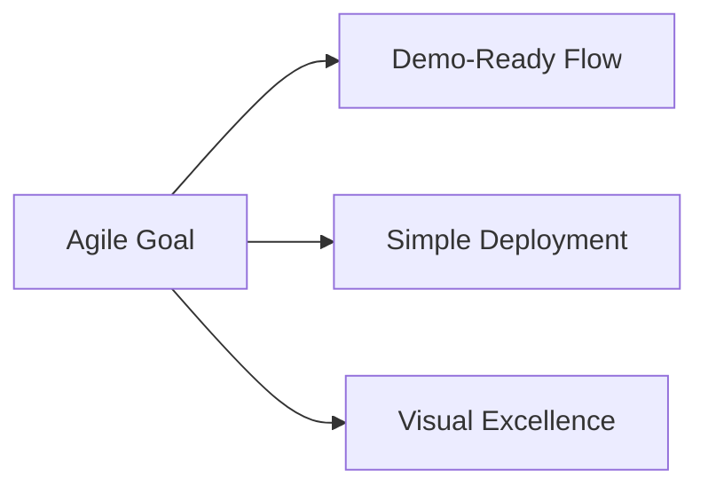
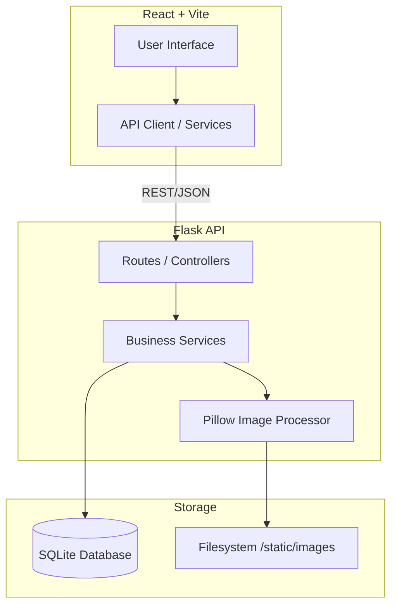
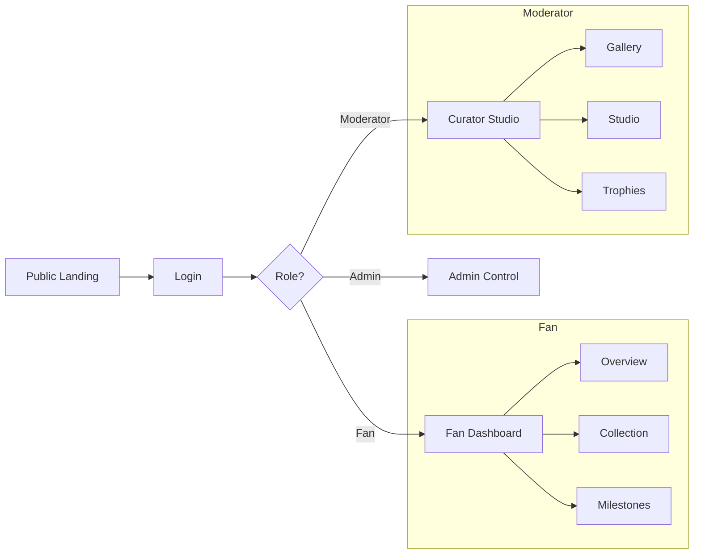
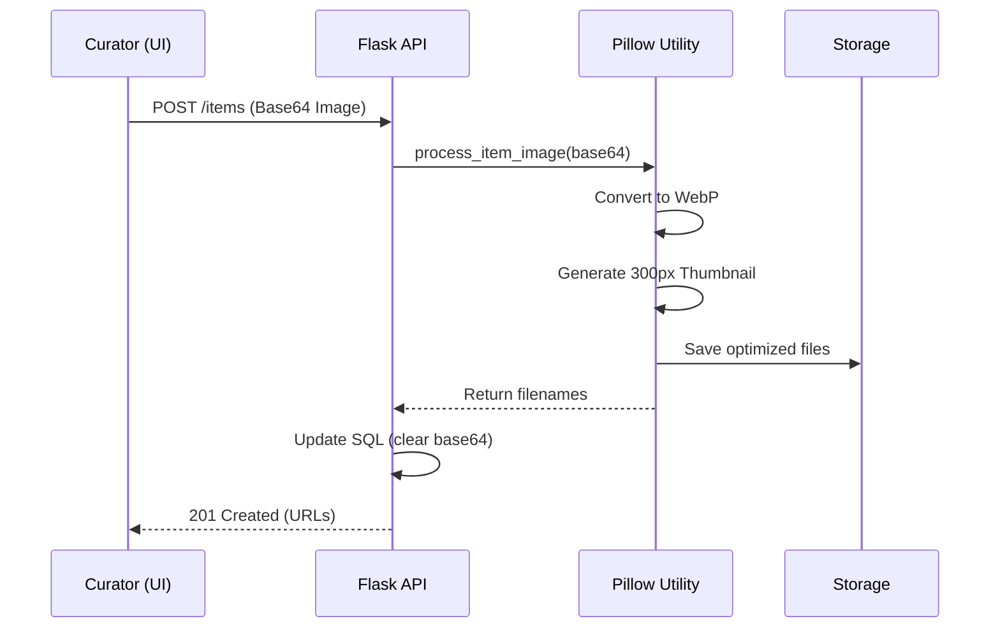
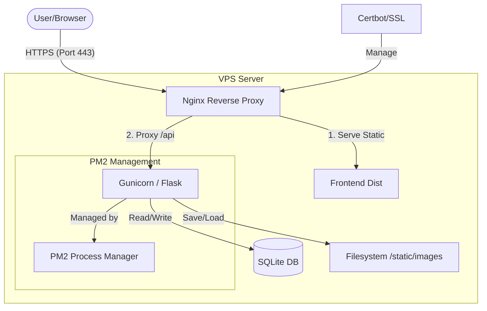

# 🏛️ FanDex - Digital Museum & Artifact Collection

FanDex is a premium, mobile-first platform designed for collectors and curators to exhibit digital artifacts. It features a dynamic rarity system, automated trophy evaluation, and an optimized image delivery engine.

## 🎯 Vision & Purpose

FanDex is conceived as a community-driven ecosystem where fans can catalog their passion, track their collection progress, and celebrate milestones. The core objective is to provide a visually stunning, frictionless experience for fans to interact with their "Private Vaults" and share their evolution within the museum.

## 🏛️ Architecture Decisions (Agile Mockup)

This version of FanDex is an **Agile Mockup (Maqueta)** designed for quick deployment and high-fidelity interaction. To prioritize rapid iteration and demonstration, the following architectural choices were made:

- **Minimalist Deployment**: Built with Flask + SQLite to ensure the entire system can be up and running in minutes without complex infrastructure.
- **Client-Side Permission Layer**: Role-based rendering and navigation are managed via `localStorage` and React state for agility, serving as a functional demonstration of the UI/UX rather than a hardened security layer.
- **Fast-Track Authentication**: The focus is on session persistence and UX flow, favoring speed of showcase over production-level protocols (like JWT/OAuth) which are slated for full-scale development.



## 🏗️ System Architecture



## 🛤️ User Flow & Navigation



## 💎 Image Optimization Flow



## 🛡️ Role-based Permissions

| Action | Admin | Moderator | Fan | Public |
| :--- | :---: | :---: | :---: | :---: |
| **View Gallery** | ✅ | ✅ | ✅ | ✅ |
| **Collect Items** | ✅ | ✅ | ✅ | ❌ |
| **Mint Artifacts** | ✅ | ✅ | ❌ | ❌ |
| **Create Milestones** | ✅ | ✅ | ❌ | ❌ |
| **Manage Users** | ✅ | ❌ | ❌ | ❌ |
| **Purge System** | ✅ | ❌ | ❌ | ❌ |

## ✨ Features

- **📱 Mobile-First Design**: Fully responsive UI across all roles (Fan, Moderator, Admin, Public).
- **🖼️ Image Optimization**: Automatic WebP conversion and thumbnail generation for high-performance browsing.
- **💎 Rarity Studio**: Real-time customization of rarity tiers, colors, and visual effects.
- **🏆 Achievement Engine**: Automated evaluation of collection milestones and trophies.
- **🔒 Secure Configuration**: Environment-based API URLs and protected credentials.

## 🛠️ Tech Stack

- **Backend**: Python / Flask / SQLite
- **Frontend**: React / Vite / Vanilla CSS
- **Image Processing**: Pillow (Optimized WebP)

---

## 🚀 Quick Start

### 1. Prerrequisites
- Python 3.10+
- Node.js 18+

### 2. Backend Setup
```bash
cd backend
pip install -r requirements.txt
cp .env.example .env  # Configure your admin credentials
python main.py
```
*The server will run on `http://localhost:5000`*

### 3. Frontend Setup
```bash
cd frontend
npm install
cp .env.example .env.development # Configure your VITE_API_URL
npm run dev
```
*The app will run on `http://localhost:5173`*

### 4. Docker Deployment (Recommended for CubePath)
Ensure you have Docker and Docker Compose installed.

```bash
# Start the entire ecosystem
docker-compose up --build
```
*   **Backend**: `http://localhost:5000`
*   **Frontend**: `http://localhost:5173`

### 5. VPS Basic Deployment (Optimized for CubePath)
For a practical, low-consumption deployment on a standard VPS, we use a classic stack that ensures stability and visual performance without the overhead of containerization.

- **Nginx**: High-performance reverse proxy for static files and API routing.
- **PM2**: Advanced process manager to keep the Flask backend active and auto-restart on crashes.
- **Certbot**: Automated SSL certificate management for secure HTTPS "firma".



#### Backend Process (PM2 + Venv)
```bash
cd backend
python3 -m venv venv
source venv/bin/activate
pip install -r requirements.txt
pm2 start ecosystem.config.js
```
The `ecosystem.config.js` is pre-configured to use the `./venv/bin/gunicorn` executable.

#### Frontend Static Serving (Nginx)
1. Build the production assets:
   ```bash
   cd frontend
   npm install
   npm run build  # Usar .env.production (por defecto)
   # O si prefieres usar .env.development específicamente:
   npm run build:dev
   ```
2. Configure Nginx using the provided template in `nginx/fandex.conf`.
3. Enable the site and restart Nginx:
   ```bash
   sudo ln -s /etc/nginx/sites-available/fandex.conf /etc/nginx/sites-enabled/
   sudo nginx -t && sudo systemctl restart nginx
   ```

#### Security & SSL (Certbot)
```bash
sudo certbot --nginx -d yourdomain.com
```

### 🛡️ Demo Safety Limits
To preserve the integrity of the public demo and prevent resource exhaustion, the following limits and safety measures are active:

- **Administration (Purge)**: The database reset endpoint is disabled by default via the `ENABLE_PURGE` toggle.
- **Entity Capacity**:
  - **Moderators**: Max 5.
  - **Fans (Citizens)**: Max 20.
  - **Artifacts (Items)**: Max 70.
  - **Metadata (Tags, Rarities, Trophies)**: Limits apply (Max 20/10).

When a limit is reached, the system will return a "demo-friendly" alert message. These limits can be adjusted in `backend/core/config.py` or via environment variables in `.env`.

---

## 🚀 Hackatón CubePath 2026 Readiness

FanDex was refactored and audited to excel in all evaluation criteria for the Hackatón CubePath 2026.

### ⚖️ Evaluation Scorecard

| Criterion | Points | Evidence |
| :--- | :---: | :--- |
| **🎨 User Experience** | **10/10** | **Premium "Vintage" aesthetic**, state-machine navigation, and a fully fixed responsive achievement grid. High-fidelity glassmorphism across all 4 user roles. |
| **💡 Creativity** | **9/10** | Original concept of a **"Digital Artifact Museum"**. Includes "Live Projection" minting and private "Fan Vaults" with automated badge unlocking. |
| **🔧 Utility** | **9/10** | Comprehensive **Curator Management System** (CRUD for items, categories, rarities, and achievements) combined with a collector gamification layer. |
| **⚙️ Technical Quality** | **10/10** | **Layered Repository-Service-Route** backend. Automated **WebP Image Factory** (B64 -> WebP + Thumbs). **VPS (PM2/Nginx) & Docker Ready** for instant CubePath deployment. |

---

## 🚀 Roadmap (Future Production Ready)

To transition from a high-fidelity mockup to a production-grade application, the following enhancements are envisioned:

- **Backend Security**: Migration to JWT-based authentication and Server-Side Role-Based Access Control (RBAC).
- **ORM & Database Scalability**: Transition from raw SQL to an ORM (like SQLAlchemy or Peewee) and from SQLite to PostgreSQL/MySQL for production workloads.
- **Improved State Management**: Implementation of **Zustand** or similar libraries for more robust and scalable frontend state handling.
- **Cloud Asset Management**: Integration with standardized **External Storage Services** (Cloud Buckets or VPS-attached storage) for professional and scalable file handling.
- **API Documentation**: Integration of **Swagger/OpenAPI** for a standardized and interactive developer reference.
- **Social Features**: Community boards, trading requests, and public profile sharing.
- **Gamification**: Advanced unlocking animations and real-time community challenges.

## 🎨 Role Credentials (Demo)

| Role | Username | Password |
| :--- | :--- | :--- |
| **Admin** | `admin` | `admin123` |
| **Moderator** | `mod1` | `1234` |
| **Fan** | `edgar` | `1234` |


---

## 📖 Documentation

For a deeper dive into the system's architecture and usage, refer to:
- **[USER_MANUAL.md](USER_MANUAL.md)**: Detailed guide on roles, views, and operational workflows.
- **[REFACTOR_WALKTHROUGH.md](REFACTOR_WALKTHROUGH.md)**: Technical audit of the frontend and backend modernization.

---

## 📦 Project Structure

- `/backend`: Flask API, Database models, and Image processing logic.
- `/frontend`: React components, custom hooks, and museum styles.
- `/backend/static/images`: Optimized artifact assets (Ignored by Git).

---

