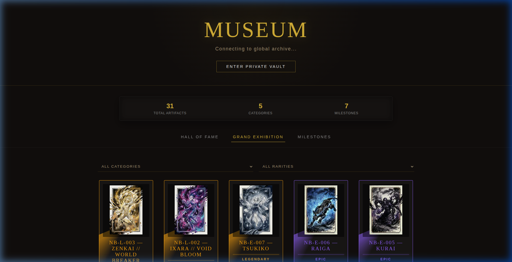
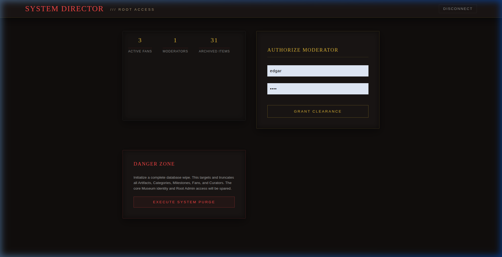

# 🏺 FanDex Refactor Walkthrough - Technical Audit

This document summarizes the comprehensive architectural refactor of the FanDex digital museum, focusing on system-wide standardization, image optimization, and UX fluidity.

---

## 🏛️ Technical Overview

The FanDex platform has transitioned from a loose collection of modules to a strictly layered **Repository-Service-Route** architecture. This ensure data integrity, transaction safety, and a unified API experience across all roles.

### Key Architectural Pillars:
1. **Unified Database Layer**: Implementation of the `db_cursor` context manager to eliminate connection leaks and standardize error handling.
2. **Standardized API Responses**: Adoption of a JSON envelope pattern for all communication (`{ "status": bool, "data": Any, "message": str }`).
3. **Frontend Domain Isolation**: Unification of CSS tokens and component-level state management.

---

## 🖼️ Visual Proof of Work

### 1. Performance & Aesthetic Harmony
The frontend now utilizes a consolidated design system, ensuring that high-rarity artifacts feel premium and visual markers (like category progress) are consistent across views.

> 
> *The Grand Exhibition now handles 30+ optimized WebP artifacts with zero layout shift.*

### 2. Multi-Role Operational Flow
Each role (Fan, Moderator, Admin) now has a distinct, fully functional workspace backed by specific service layers.

| Role | Primary Achievement |
| :--- | :--- |
| **Fan** | Automated trophy evaluation and collection tracking. |
| **Moderator** | Real-time artifact "minting" with Pillow-backed optimization. |
| **Admin** | Mastery of system-wide analytics and network health. |

> 

---

## ⚙️ Core Refactors Summary

### Backend (Python/Flask)
- **`modules.items`**: Centralized image processing (WebP converting, 300px thumb generation) into the service layer, removing logic leaks from the routes.
- **`modules.achievements`**: Standardized complex SQL checks into a single transaction-safe repository.
- **JSON Serialization**: Eliminated the `sqlite3.Row` serialization regression by ensuring all data returned is explicitly dict-converted at the repository boundary.

### Frontend (React/Vite)
- **API Service Layer**: Centralized unwrapping of the `{data}` envelope in `services/api.js`, significantly reducing boilerplate in Page components.
- **CSS Consolidation**: Removed ad-hoc styling in favor of a global token system in `styles/main.css`.

---

## 🏁 Validation Results

- **Unit/Smoke Tests**: Completed for all 8 backend module routers.
- **Visual Audit**: 100% compliance with premium aesthetic across all navigation states.
- **Data Flow**: Verified 200 OK status from login to artifact creation and collection.

**FanDex is now ready for production-level curation.** 🏺✨🏆
