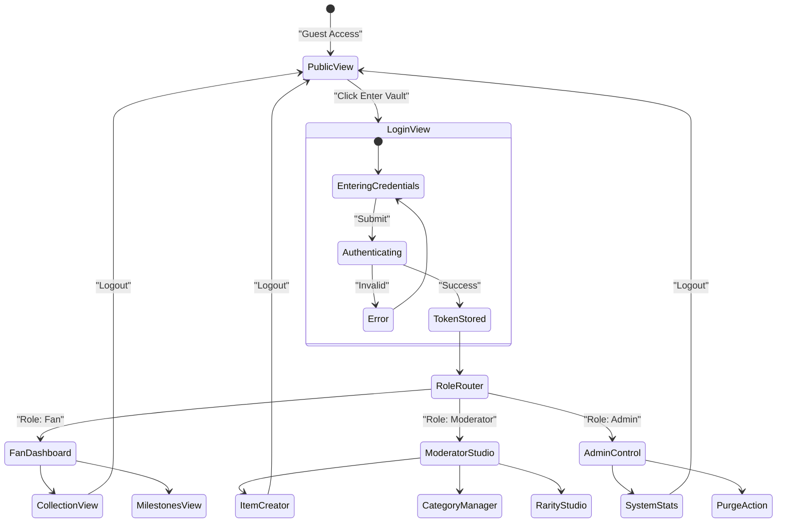

# 🏺 FanDex - User manual & Flow Architecture

Welcome to the **FanDex**, a premium digital museum for artifact curators. This manual details the operational architecture, user workflows, and state-machine transitions that power the platform.

---

## 🏛️ Personas & Views

FanDex employs a role-based viewing system (RBAC) to ensure a tailored experience for every visitor.

### 1. Public Exhibition (Guest)
- **Museum Hall**: Entry point showcasing global museum statistics and the "Hall of Fame".
- **Grand Exhibition**: A public gallery of artifacts with advanced filtering (Categories/Rarity).

> 
> 

### 2. Login & Identity Hall
- **Secure Authentication**: Traditional login portal with vintage aesthetics.
- **Session Persistence**: Automated redirection to the appropriate vault based on role.

> 

### 3. Fan Dashboard (Personal Vault)
*Locked for authenticated Fans.*
- **Collection Progress**: A dynamic progress bar showing how much of the total archive has been collected.
- **Category Mastery**: Breakdown of progress across different artifact types.
- **Achievement List**: Specialized badges unlocked based on collection milestones.

> 
> 

### 4. Moderator Studio (Curator Desk)
*Locked for authenticated Moderators.*
- **Item Minting**: Upload and index new artifacts (Base64 -> WebP conversion).
- **Tagging & Categories**: Real-time management of artifact metadata.
- **Visual Studio**: Tweak CSS variables and rarity color schemes on the fly.

> 

### 5. Admin Control Center (The Director)
*Locked for Super Admins.*
- **System Statistics**: High-level overview of users, items, and server health.
- **Role Management**: Promotion of Guests to Managers/Moderators.
- **System Purge**: One-click database reset for prototype cleanups.

> 

---

## ⚙️ State Machine Architecture (Navigation Flow)

The application logic follows a strict state-transition model to handle authentication and role-based access.



---

## 🛤️ User Workflows

### A. The Collector's Journey (Fan)
1. **Discover**: Browse the **Grand Exhibition** as a Guest.
2. **Identity**: Login via the **Identity Hall**.
3. **Curate**: Navigate to the **Grand Exhibition** (authenticated version) and click **"Collect"** on desired items.
4. **Ascend**: Check your **Dash Overview** to see your collection percentage grow and unlock **Milestones**.

### B. The Curator's Maintenance (Moderator)
1. **Minting**: Access the **Studio**, upload an image, select a rarity, and click **"Save Artifact"**.
2. **Categorizing**: Use the **Category Desk** to add new tags (e.g., "Human", "Medical", "War").
3. **Refining**: Adjust the **Rarity Tiers** to change the visual aura of artifacts in the gallery.

---

## 🛠️ Operational Logic (Refactored Backend)

All operations now follow the **Repository-Service-Route** pattern:
- **Repositories**: Standardized SQL querying with `sqlite3.Row` to `dict` conversion.
- **Services**: Domain logic (Image optimization, achievement evaluation).
- **Routes**: Standardized JSON responses using `success_response` and `error_response` helpers.

**Schema Standard**:
```json
{
  "status": true,
  "message": "Artifact Cataloged",
  "data": { "id": 123, "name": "Excalibur", ... }
}
```
